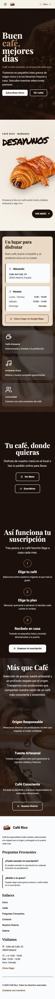
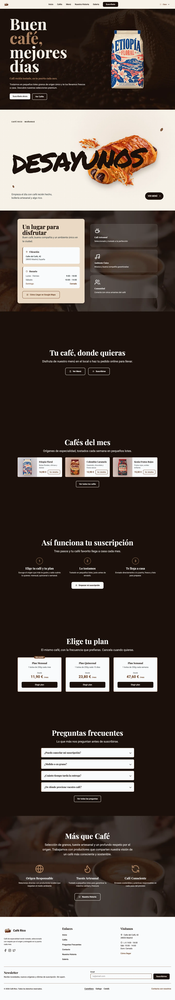
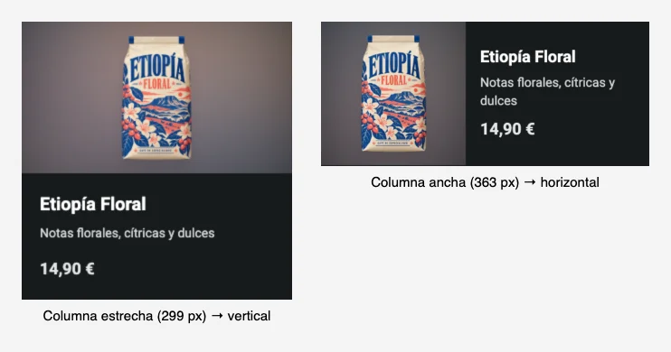

# Lab · Module 01 · Layout + Tailwind CSS

## O9 · README + AI Log

### Tema elegido

_Tema A — Tueste_

---

### Cómo arrancarlo

```bash
npm install
npm run dev
```

Comandos del proyecto:

| Comando                | Qué hace                                                                                                    |
| ---------------------- | ----------------------------------------------------------------------------------------------------------- |
| `npm run dev`          | Servidor de desarrollo de Vite (expuesto en la red local con `--host`).                                     |
| `npm run build`        | Build de producción en `dist/`, con las páginas de cada café generadas a partir de `src/data/coffees.json`. |
| `npm run preview`      | Sirve el build de `dist/` (es lo que se usó para medir con Lighthouse).                                     |
| `npm run format`       | Formatea todo el proyecto con Prettier y ordena las clases de Tailwind (`prettier-plugin-tailwindcss`).     |
| `npm run format:check` | Comprueba el formato sin cambiar nada; falla si algún archivo no está formateado.                           |

**Navegadores soportados:** Chrome 114+ (mayo de 2023), Safari 17+ (septiembre de 2023) y Firefox 128+ (julio de 2024), por Tailwind v4 y el menú con `popover`.

---

### Idiomas

La web está en castellano, gallego y catalán: el castellano en la raíz (`/`) y cada idioma en su carpeta (`/gl/`, `/ca/`), con un selector en el pie. Las traducciones se aplican al construir la web, no en el navegador: cada idioma es HTML estático con su `lang`, su `<title>` y su descripción, sin JavaScript extra ni parpadeo del texto, y con las mismas notas de Lighthouse que el castellano.

- **Textos de la interfaz:** [es.json](src/locales/es.json), [gl.json](src/locales/gl.json) y [ca.json](src/locales/ca.json) (formato JSON anidado de i18next); el marcado usa `{{t:clave}}`.
- **Datos (cafés, menú, FAQ, galería, planes):** siguen en castellano en `src/data/`; las traducciones van en `gl.json` y `ca.json`, bajo `data`, por `id` de cada elemento.
- **Cómo se genera:** [i18n.js](vite-plugins/i18n.js) crea las copias `/gl/` y `/ca/` de cada página, traduce las claves, pone el `lang` y mantiene los enlaces en el mismo idioma; [coffee-pages.js](vite-plugins/coffee-pages.js) hace lo mismo con las páginas de cada café.
- Las traducciones al gallego y al catalán están pendientes de revisión por una persona nativa.

---

### Opción de integración de Tailwind

| Método elegido | Por qué                                                                                                                                                                                                                                |
| -------------- | -------------------------------------------------------------------------------------------------------------------------------------------------------------------------------------------------------------------------------------- |
| Vite plugin    | Es la opción más sencilla y no necesito procesar el CSS por mi cuenta: Tailwind v4 ya añade los prefijos de navegador y baja la sintaxis nueva con Lightning CSS, así que PostCSS\* y Autoprefixer no aportarían nada que me interese. |

\*En una configuración estándar de Tailwind v4 con Vite, PostCSS y Autoprefixer suelen ser innecesarios, pero PostCSS sigue siendo útil si necesitas otros plugins o transformaciones específicas.

---

### Capturas

| Móvil                                                        | Escritorio                                                             |
| ------------------------------------------------------------ | ---------------------------------------------------------------------- |
|  |  |

Resto de páginas en el tema claro (página completa, móvil 390 px y escritorio 1440 px), regeneradas el 10 de octubre de 2026 sobre el build de producción. Los otros cinco temas están en [docs/screenshots](docs/screenshots/README.md).

| Página          | Móvil                                                 | Escritorio                                                 |
| --------------- | ----------------------------------------------------- | ---------------------------------------------------------- |
| Cafés           | [ver](docs/screenshots/light/movil-cafes.webp)        | [ver](docs/screenshots/light/escritorio-cafes.webp)        |
| Detalle de café | [ver](docs/screenshots/light/movil-detalle-cafe.webp) | [ver](docs/screenshots/light/escritorio-detalle-cafe.webp) |
| Menú            | [ver](docs/screenshots/light/movil-menu.webp)         | [ver](docs/screenshots/light/escritorio-menu.webp)         |
| Galería         | [ver](docs/screenshots/light/movil-galeria.webp)      | [ver](docs/screenshots/light/escritorio-galeria.webp)      |
| Historia        | [ver](docs/screenshots/light/movil-historia.webp)     | [ver](docs/screenshots/light/escritorio-historia.webp)     |
| Contacto        | [ver](docs/screenshots/light/movil-contacto.webp)     | [ver](docs/screenshots/light/escritorio-contacto.webp)     |
| FAQ             | [ver](docs/screenshots/light/movil-faq.webp)          | [ver](docs/screenshots/light/escritorio-faq.webp)          |
| Suscripción     | [ver](docs/screenshots/light/movil-suscripcion.webp)  | [ver](docs/screenshots/light/escritorio-suscripcion.webp)  |

---

### Lighthouse (móvil y escritorio)

Rendimiento / Accesibilidad por página y tema. Medido el 10 de octubre de 2026 con Lighthouse 13 sobre el build de producción (`npm run build` + `npm run preview`), un pase por combinación (108 mediciones), cada una en un navegador nuevo (caché vacía, como una primera visita). El tema se fija en `localStorage` antes de cada medición.

#### Móvil

| Página               | Claro     | Oscuro    | Matcha    | Café      | Azul      | Violeta   |
| -------------------- | --------- | --------- | --------- | --------- | --------- | --------- |
| Inicio               | 99 / 100  | 99 / 100  | 99 / 100  | 99 / 100  | 99 / 100  | 99 / 100  |
| Cafés                | 99 / 100  | 99 / 100  | 99 / 100  | 99 / 100  | 99 / 100  | 99 / 100  |
| Detalle de café      | 99 / 100  | 99 / 100  | 99 / 100  | 99 / 100  | 99 / 100  | 99 / 100  |
| Menú                 | 99 / 100  | 99 / 100  | 99 / 100  | 99 / 100  | 99 / 100  | 99 / 100  |
| Historia             | 100 / 100 | 100 / 100 | 100 / 100 | 100 / 100 | 100 / 100 | 100 / 100 |
| Galería              | 99 / 100  | 99 / 100  | 99 / 100  | 99 / 100  | 99 / 100  | 99 / 100  |
| Preguntas frecuentes | 100 / 100 | 100 / 100 | 100 / 100 | 100 / 100 | 100 / 100 | 100 / 100 |
| Contacto             | 99 / 100  | 99 / 100  | 99 / 100  | 99 / 100  | 99 / 100  | 100 / 100 |
| Suscripción          | 99 / 100  | 99 / 100  | 99 / 100  | 99 / 100  | 99 / 100  | 99 / 100  |

#### Escritorio

| Página               | Claro     | Oscuro    | Matcha    | Café      | Azul      | Violeta   |
| -------------------- | --------- | --------- | --------- | --------- | --------- | --------- |
| Inicio               | 100 / 100 | 100 / 100 | 100 / 100 | 100 / 100 | 100 / 100 | 100 / 100 |
| Cafés                | 100 / 100 | 100 / 100 | 100 / 100 | 100 / 100 | 100 / 100 | 100 / 100 |
| Detalle de café      | 100 / 100 | 100 / 100 | 100 / 100 | 100 / 100 | 100 / 100 | 100 / 100 |
| Menú                 | 100 / 100 | 100 / 100 | 100 / 100 | 100 / 100 | 100 / 100 | 100 / 100 |
| Historia             | 100 / 100 | 100 / 100 | 100 / 100 | 100 / 100 | 100 / 100 | 100 / 100 |
| Galería              | 100 / 100 | 100 / 100 | 100 / 100 | 100 / 100 | 100 / 100 | 100 / 100 |
| Preguntas frecuentes | 100 / 100 | 100 / 100 | 100 / 100 | 100 / 100 | 100 / 100 | 100 / 100 |
| Contacto             | 100 / 100 | 100 / 100 | 100 / 100 | 100 / 100 | 100 / 100 | 100 / 100 |
| Suscripción          | 100 / 100 | 100 / 100 | 100 / 100 | 100 / 100 | 100 / 100 | 100 / 100 |

- **Accesibilidad:** 100 en las 108 combinaciones (el objetivo era ≥ 90).
- **Rendimiento:** escritorio da 100 en todo. En móvil la nota va de 99 a 100 (antes de las mejoras, de 93 a 99): Historia y Preguntas frecuentes dan 100 y el resto 99 (Contacto da 100 en el tema violeta). El primer pintado (FCP) en móvil es de 0,9 s en todas las páginas menos Inicio (1,2 s); lo que separa del 100 es el LCP, de 1,8 a 2,3 s.
- **Qué se hizo para llegar aquí:** imágenes en WebP con `srcset` y `sizes`, `width` y `height` en las ``, `loading="lazy"` bajo el primer pantallazo y `fetchpriority="high"` en la imagen del LCP, la altura de la cabecera fijada en CSS y las listas (cafés, carta, galería, FAQ) generadas al construir la web en vez de rellenarse con JS, así que llegan ya en el HTML y no provocan saltos de diseño, variantes de tamaño para cada uso (las bolsas, por ejemplo, en 120, 200, 300, 400, 600 y 800 px), el script del tema (`theme-init.js`) escrito dentro de cada página en vez de enlazado ([inline-theme-script.js](vite-plugins/inline-theme-script.js)), que quita una petición bloqueante, y las mejoras del análisis de abajo: tres archivos de fuente en vez de seis (Roboto variable, Playfair Display 700 y Permanent Marker, que solo carga Inicio), las fuentes precargadas, el JS con prioridad baja y la foto del hero más ligera en móvil. La bolsa del hero lleva `fetchpriority="low"` porque con `high` competía con la foto de fondo, que es el LCP.
- **D7 (Lighthouse 100) no está conseguido del todo:** escritorio da 100 en todo, pero en móvil solo dos páginas llegan a 100. En el resto falta un punto por el LCP (alrededor de 2,0 s), en el que pesan las fuentes (Roboto y Playfair Display, unos 64 kB precargados) y las imágenes que se piden antes de pintar. Inicio necesita además la foto del hero, que es su LCP. Llegar a 100 en todas exigiría volver a la fuente del sistema para el texto o bajar la calidad visible de las imágenes.
- Un solo pase por combinación puede variar un punto entre ejecuciones.
- **Corrección del método:** una primera versión de estas tablas medía las nueve páginas de cada tema seguidas en el mismo navegador sin vaciar la caché, así que todas menos la primera (Inicio) se beneficiaban del CSS y las fuentes ya descargados y salían a 100. Con la caché vacía, Suscripción baja de 100 a 99 y su LCP de 1,1 a 2,0 s. Las tablas de arriba ya están medidas con la caché vacía; las comparaciones de una sola página del análisis siempre se midieron así.

#### Análisis del rendimiento en móvil (9 y 10 de octubre de 2026)

Para saber qué frena el móvil se midió Lighthouse 13 (solo rendimiento, móvil) sobre el build de producción y sobre copias de `dist/` modificadas a mano, antes de tocar el código.

**Primera ronda: las fuentes.** Medido el 9 de octubre en el tema claro. La primera columna es `npm run preview`; las otras tres, un servidor estático propio con Brotli.

| Página          | `vite preview` | Servidor con Brotli | CSS inline (mismo servidor) | Sin Roboto (mismo servidor) |
| --------------- | -------------- | ------------------- | --------------------------- | --------------------------- |
| Inicio          | 94             | 95                  | 93                          | 98                          |
| Cafés           | 93             | 98                  | 96                          | 99                          |
| Detalle de café | 97             | 97                  | 96                          | 99                          |
| Menú            | 98             | 98                  | —                           | 100                         |
| Historia        | 96             | 96                  | 97                          | 99                          |
| Galería         | 94             | 95                  | 92                          | 97                          |
| Suscripción     | 97             | 98                  | —                           | 98                          |

- **Inlinar el CSS sigue sin ayudar:** el FCP no baja (2,0 s en Inicio, 1,7 s en el resto). El CSS no es lo que frena el primer pintado. `vite preview` ya sirve el CSS comprimido (unos 14 kB transferidos de 83 kB), así que la diferencia entre las dos primeras columnas viene del servidor, no de la compresión.
- **El cuello de botella eran las fuentes.** Las seis fuentes (Roboto 400/500/700, Playfair Display 500/700 y Permanent Marker) se descubren en el CSS y se piden con prioridad alta, y la simulación de móvil de Lighthouse las cuenta en el primer pintado. Quitando todos los `@font-face`, el FCP bajaba de 1,7 s a 0,9 s.
- **Lo que se aplicó:** se quitó Roboto (el texto de cuerpo usa la fuente del sistema, `system-ui`) y el peso 500 de Playfair Display. Ningún título pedía el 500: lo descargaban tres `h3` de Inicio y los `h2` ocultos (`sr-only`), que piden peso 400, y sin archivo de 400 el navegador bajaba el más cercano. Ahora todos usan el 700. Permanent Marker se mantiene para el título de «Desayunos» y solo se descarga en Inicio. Con esto el móvil pasó a 98–100. Más tarde Roboto volvió con un solo archivo (ver «Roboto de vuelta» abajo).

**Segunda y tercera ronda: los últimos puntos.** Medido el 10 de octubre con `vite preview`, comparando cada cambio con dos pases.

- **Fuente de los títulos precargada** ([preload-fonts.js](vite-plugins/preload-fonts.js)): en móvil, la página se pintaba con la serif de respaldo, que es más ancha, y «Configura tu Suscripción» ocupaba dos líneas; al llegar Playfair Display pasaba a una y todo lo de debajo subía 36 px (un CLS de 0,074 que también veía el usuario). Con el `preload` la fuente llega con el CSS, el salto desaparece y el FCP baja a 0,8 s. Suscripción pasa de 98–99 a 100.
- **JS con prioridad baja** ([low-priority-scripts.js](vite-plugins/low-priority-scripts.js)): los `<script type="module">` y los `modulepreload` que añade Vite no bloquean el pintado, pero Chrome los pedía con prioridad alta y la simulación los contaba. Con `fetchpriority="low"` el FCP de Inicio y Suscripción baja unos 0,3 s. La página se pinta y aplica el tema sin ellos.
- **Foto de fondo del hero a 400 px en móvil** (19 kB en vez de 49 kB): va detrás de una capa oscura del 80–85 %, así que no se nota la diferencia, e Inicio pasa de 98 a 99.
- **Miniaturas de 120 px en el asistente de suscripción:** se muestran a 64 px de ancho y cargaban la versión de 200 px (unos 19 kB cada una, seis antes del primer pintado). La de 120 px pesa unos 10 kB y basta para la densidad de pantalla del móvil que simula Lighthouse; los móviles de más densidad siguen eligiendo la de 200 px.
- **Foto de Historia con prioridad baja:** el elemento LCP de Historia en móvil es un párrafo de texto, pero la foto que tiene al lado se pedía con prioridad media antes de pintarlo y la simulación la contaba. Con `fetchpriority="low"` en esa foto el LCP baja de 2,0 a 1,5 s y Historia pasa de 99 a 100 (escritorio sigue en 100).
- **Roboto de vuelta:** el texto de cuerpo vuelve a ser Roboto, pero en su versión variable (`@fontsource-variable/roboto`): un solo archivo latino de 40 kB con todos los pesos, en lugar de tres archivos estáticos (unos 66 kB). Se precarga junto a Playfair Display. Sin precarga costaba un punto en Inicio, Historia y Suscripción; con ella Inicio, Historia y FAQ se quedan igual que con la fuente del sistema y sin saltos de layout, pero Suscripción (y, por lo que dan las tablas, la mayoría de páginas con el LCP en un texto) pierde un punto: de 100 a 99, por los 40 kB más que se piden antes de pintar. Al probarlo apareció un detalle: las flechas `←`, `→`, `↗` y las estrellas `★` escritas como texto caían fuera del subconjunto latino y hacían descargar además los archivos `symbols` y `math` de Roboto (61 kB más). Se cambiaron por iconos SVG con máscara (`arrow-left`, `arrow-right`, `arrow-up-right` y `star` en `public/icons/ui/`), como ya pedía la convención del proyecto, y con eso cada página descarga solo el archivo latino. De paso se corrigió que el botón «Siguiente» del asistente nunca mostraba su flecha: el JS reescribía todo el texto del botón.
- **Probado y descartado:** meter los iconos SVG dentro del CSS como data URI (el CSS crece y la nota no mejora), quitar el `preload` del hero o su `fetchpriority` (sin cambio), recomprimir las fotos de Historia (de 70 a 62 kB, sin efecto), servir a Historia una foto de 400 px (da 100, pero se ve borrosa), `content-visibility: auto` en la sección de desayuno para retrasar Permanent Marker (sin cambio: está justo debajo del hero), un fondo del hero desenfocado de 1,2 kB que Chrome descarta como LCP (cambia el diseño, el LCP pasa a la bolsa y la nota sigue en 99) y dar a la bolsa del hero `fetchpriority="high"` (empeora a 98–99).
- **Galería y Cafés (las dos peores tras corregir el método):** las seis fotos de 800 px se recodificaron desde los originales con calidad 60 (266 kB en vez de 307 kB, sin diferencia visible a tamaño real) y Galería pasa de 97 a 99 (LCP de 2,6 a 2,3 s). En Cafés, el `sizes` de las tarjetas decía 160 px cuando la bolsa se muestra a unos 91 px en móvil; con un `sizes` real el móvil descarga la variante de 200 px en vez de la de 300, y el fondo desenfocado usa la de 120 px (de unos 55 a 30 kB por tarjeta). Cafés queda en 99 en todos los temas.

---

### ✅ Checklist

#### Obligatorios (O1–O9)

- [x] **O1** — Estructura semántica (`<header>`, `<nav>`, `<main>`, `<section>`, `<article>`, `<footer>`, un solo `<h1>`, `alt` en imágenes)
- [x] **O2** — Tema visual con `@theme` (color de marca `coffee-50…950`, acento, tipografía personalizada). Los tonos no se usan como `bg-coffee-*` en el HTML: [themes.css](src/styles/themes.css) los asigna a variables semánticas (`--surface-page`, `--accent`…) por tema, y el marcado usa esas variables para que un cambio de tema no toque el HTML (D3)
- [x] **O3** — Cabecera con flexbox (logo izquierda, menú derecha, responsive, `hover:` + `focus-visible:`)
- [x] **O4** — Hero (título + texto + 2 botones + `` de una bolsa de café sobre una foto de fondo; en columna en móvil y texto e imagen lado a lado desde `md:`, con `max-w-prose` en el párrafo)
- [x] **O5** — Rejilla de tarjetas (6+ tarjetas, `grid-cols-1 sm:grid-cols-2 lg:grid-cols-3`, hover lift, `aspect-video` con la bolsa en `object-contain` sobre un fondo desenfocado en `object-cover`)
- [x] **O6** — Sección de pasos (3 items, `flex-col md:flex-row`, contenido centrado)
- [x] **O7** — Pie de página (3+ columnas en escritorio, apiladas en móvil, copyright con `border-top`)
- [x] **O8** — Accesibilidad (navegación por teclado, `focus-visible:`, Lighthouse ≥ 90)
- [x] **O9** — README + bitácora de IA (este archivo)

#### Opcionales (P1–P7)

- [x] **P1** — Modo oscuro con toggle (en vez de `dark:` o `@custom-variant`, el tema se guarda en `data-theme` y cada tema define sus variables CSS; sin elección guardada sigue `prefers-color-scheme`)
- [x] **P2** — Cabecera fija con efecto cristal (`sticky backdrop-blur`)
- [x] **P3** — Planes con tarjeta destacada: sección `#plans` de la home con 3 tarjetas ([plan-card.html](src/components/subscription/plan-card.html), datos en [plans.json](src/data/plans.json)) y la del plan mensual destacada con borde de acento y una insignia «Más popular» con `absolute -top-3`; el asistente de [suscripción](src/pages/subscription.html) reutiliza los mismos datos
- [x] **P4** — FAQ plegable sin JavaScript (`<details class="group">` + `group-open:-rotate-[135deg]` en el icono, ver [faq-item.html](src/components/content/faq-item.html))
- [x] **P5** — Formulario con estados (`focus:`, `user-invalid:`, `disabled:`; el aviso de error usa `peer-user-invalid:block` y `peer-aria-invalid:block` dentro de `.form__error` en [ui.css](src/styles/components/ui.css), y los campos llevan `peer` en [form-field.html](src/components/forms/form-field.html); `aria-invalid` se pone desde JS para el envío y los pasos)
- [x] **P6** — Bento grid (`col-span-2 row-span-2`)
- [x] **P7** — Animaciones con `motion-safe:`

#### Desafíos (D1–D7)

- [x] **D1** — Menú hamburguesa sin JavaScript
- [x] **D2** — Container queries (`@container` + `@xs:`)
- [x] **D3** — Multitema vía CSS variables + `[data-theme]`
- [x] **D4** — Custom `@utility`
- [ ] **D5** — Layout de aplicación con grid areas
- [ ] **D6** — Screenshot → AI code → refine
- [ ] **D7** — Lighthouse 100

---

### Decisiones técnicas

#### P2 · Cabecera `sticky` y no `fixed`, y para qué sirve el `z-index`

La cabecera usa `sticky top-0 z-50` ([app-header.html](src/components/layout/app-header.html)).

- **Por qué `sticky` y no `fixed`:** una cabecera `fixed` sale del flujo del documento, así que no ocupa sitio y el contenido empieza debajo de ella; hay que compensarlo con un `padding-top` igual a su altura, y esa altura cambia cuando el menú pasa a dos filas en móvil. Con `sticky` la cabecera sigue en el flujo, reserva su propio espacio y solo se queda pegada arriba al hacer scroll. No hay que calcular nada.
- **Por qué el `z-index`:** al hacer scroll, el contenido pasa por debajo de la cabecera. Sin `z-index`, los elementos posicionados que vienen después en el HTML (imágenes con `relative`, tarjetas con `transform` en el hover, el hero con `isolation`) se pintan encima de ella. Con `z-50` la cabecera queda por encima de todos.
- **Cristal:** el efecto de la cabecera es `backdrop-filter: blur(12px)` sobre un fondo semitransparente que sale de la variable del tema (`--surface-header`), así que funciona igual en los seis temas.

#### D1 · Menú hamburguesa sin JavaScript: qué problemas tiene cada técnica

En móvil el menú se esconde tras un botón ☰. Lo he hecho con el atributo `popover` y `popovertarget` ([app-header.html](src/components/layout/app-header.html)), no con `checkbox` ni con `<details>`. Los problemas de accesibilidad de cada opción:

| Técnica                                      | Problemas de accesibilidad                                                                                                                                                                                                                                                                                                                                                     |
| -------------------------------------------- | ------------------------------------------------------------------------------------------------------------------------------------------------------------------------------------------------------------------------------------------------------------------------------------------------------------------------------------------------------------------------------ |
| **`checkbox` + `peer` + `peer-checked:`**    | Un lector de pantalla anuncia «casilla de verificación», no «botón de menú», y no comunica si el menú está abierto o cerrado salvo que se añada `aria-expanded` con JS. La casilla suele ocultarse, así que hay que dibujar el foco a mano (`peer-focus-visible:`) o el teclado no ve dónde está. Tampoco se cierra con Esc ni al pulsar fuera, y esas dos cosas necesitan JS. |
| **`<details>` / `<summary>`**                | Es lo más accesible de serie: `summary` es un botón con teclado (Enter y Espacio) y anuncia su estado. Pero tampoco se cierra con Esc ni al pulsar fuera, es difícil dejarlo siempre abierto en escritorio (hay que ponerle el atributo `open` con JS) y como panel flotante el estilo es limitado.                                                                            |
| **`popover` + `popovertarget` (la que uso)** | Se cierra con Esc y al pulsar fuera, sin JS, y devuelve el foco al botón. El botón sigue siendo un `<button>` real con `aria-label="Menú"`. El inconveniente es el soporte: Chrome 114+, Safari 17+ y Firefox 128+, que ya cubre la línea de navegadores que declaro arriba.                                                                                                   |

Con las tres técnicas, el menú debe poder usarse solo con teclado: con `popover`, el primer Tab tras el botón entra en los enlaces porque el panel está justo después en el HTML. No lo he probado con lector de pantalla.

#### D2 · Container queries

La tarjeta de café ([coffee-card.html](src/components/coffee/coffee-card.html)) y la del menú ([menu-item.html](src/components/content/menu-item.html)) cambian de diseño según el ancho de **su propia columna**, no el de la ventana: el `<li>` es el contenedor (`@container`) y la tarjeta usa `@xs:` (20rem). En una columna estrecha es vertical (imagen arriba) y a partir de 20rem pasa a horizontal (imagen a la izquierda). Se ve en las páginas **Cafés** y **Menú**, al estrechar la ventana: en móvil y en pantallas grandes (con tres columnas anchas) salen horizontales, y en tablet y escritorio medio (columnas estrechas) verticales.

La misma tarjeta (la primera de Cafés), medida en dos columnas de distinto ancho: a 1024 px de ventana la columna mide 299 px y la tarjeta es vertical; a 1280 px mide 363 px y es horizontal.



#### D4 · Utilidades propias con `@utility`

Las utilidades propias están en [utilities.css](src/styles/utilities.css): `page-gutter` (margen lateral responsive), `theme-transition` (transición de color al cambiar de tema) y `enter-fade-up` (animación de entrada con `motion-safe:`). Al ser `@utility` aceptan variantes (`md:page-gutter`, `hover:enter-fade-up`), que una clase normal no.

**Cuándo crear una utilidad o un componente y cuándo repetir clases**

- **Repetir clases** cuando es algo pequeño y el elemento aparece pocas veces: es lo más legible, porque el estilo está donde se usa y no hay que saltar a otro archivo.
- **Crear una utilidad con `@utility`** cuando es un puñado de declaraciones que van siempre juntas, sin estructura, y se repiten en muchos sitios y con variantes. Por ejemplo `theme-transition` está en 10 archivos.
- **Crear un componente** (HTML/JS en `src/components/`) cuando se repite una estructura entera, no solo estilos: la tarjeta de café, el elemento del menú, la cabecera o el pie. Reutilizar clases en markup copiado a mano genera divergencias; con un componente se cambia en un sitio.
- **Crear una clase semántica en CSS** (`btn btn--primary`) cuando varios elementos comparten un patrón visual que además tiene nombre y significado propio.

**Por qué abusar de `@apply` se considera mala práctica**

- Pierdes la ventaja principal de Tailwind: tener el estilo junto al elemento, sin inventar nombres ni cambiar de archivo.
- El CSS final crece, porque cada clase con `@apply` copia sus declaraciones, mientras que una utilidad se genera una sola vez y se reutiliza.
- Hay que inventar y mantener nombres, y es más difícil saber qué clases siguen en uso.
- En Tailwind v4 los archivos CSS separados necesitan `@reference` para poder usarlo.
- La propia documentación de Tailwind recomienda usarlo poco y preferir extraer un componente.

En este proyecto lo uso poco, y de forma consciente (unas 40 líneas, solo en componentes compartidos como `btn`, `form__error` o `heading`, y en los estilos base de los elementos nativos). Lo que se repite en el HTML se extrae primero como componente de `src/components/` (`cta-card`, `faq-item`, `home-section`…), y el resto de utilidades queda escrito directamente en el marcado.

---

### 🤖 Bitácora de IA

**Herramienta(s) utilizada(s):** _ChatGPT para generar imagenes y contenido, OpenCode y Claude como herramientas para trabajar en el proyecto_

Me he turnado entre OpenCode y Claude para generar la mayor parte del código sin necesidad de pagar ninguna subscripción a mayores.

---

#### Ejemplo 1 · Optimizar las imágenes

### Prompt

> "How to reduce the download time of images?..." (¿Cómo reduzco el tiempo de descarga de las imágenes?)

### Qué me dio

Un script con `sharp` que convirtió 20 imágenes a WebP redimensionadas (de ~40 MB a ~3,5 MB) y cambió las 32 referencias en el sitio.

### Qué corregí y por qué

Pedí deshacer la dependencia y mover el script a otro repositorio de herramientas web, para reutilizarlo si hace falta sin manchar el proyecto innecesariamente.

---

#### Ejemplo 2 · Convención BEM

### Prompt

> "Quiero respetar la convención BEM en todas las clases CSS"

### Qué me dio

La IA recorrió todo el CSS y marcó las clases que no seguían `bloque__elemento--modificador`. Esa lista fue la base de la revisión.

### Qué corregí y por qué

No renombré todo lo que la IA marcó. Decidí qué cambiaba y qué se quedaba; por ejemplo, `form__label` y `btn btn--primary` se quedan como clases compartidas entre formularios, definidas en `ui.css`.

---

#### Ejemplo 3 · Formulario de suscripción

### Prompt

> "Genera un formulario de subscripción con pasos y barra de progreso"

### Qué me dio

Un formulario bien montado y bonito.

### Qué corregí y por qué

Corregí los colores para cada tema y el diseño responsive. Además, el envío daba sensación de fallo (no pasaba nada), así que añadí un `console.info` para confirmar la suscripción y una tarjeta de confirmación.

---

#### Ejemplo 4 · Revisión de código de todo el proyecto

### Prompt

> "code-review for all project"

### Qué me dio

Un informe con unos 25 hallazgos de estándares (secciones sin encabezado, ids que no seguían BEM, una clase `heading--page` sin definir…) y otros tantos de especificación, en el que además aseguraba que faltaba el bento de la galería (P6) y que el README decía «384 líneas con `@apply`».

### Qué corregí y por qué

Comprobé los datos antes de arreglar nada. El bento no faltaba: la clase `lg:col-span-2 lg:row-span-2` sale del campo `layout` de los datos y por eso no aparece en el HTML fuente, así que era un falso positivo. El README sí estaba mal: `@apply` aparecía unas 40 veces, no 384, y también enlazaba archivos CSS ya borrados. Arreglé lo real (encabezados y `aria-labelledby`, ids BEM, la clase sin definir, el README) y dejé como estaba lo que la IA había entendido mal.

---
